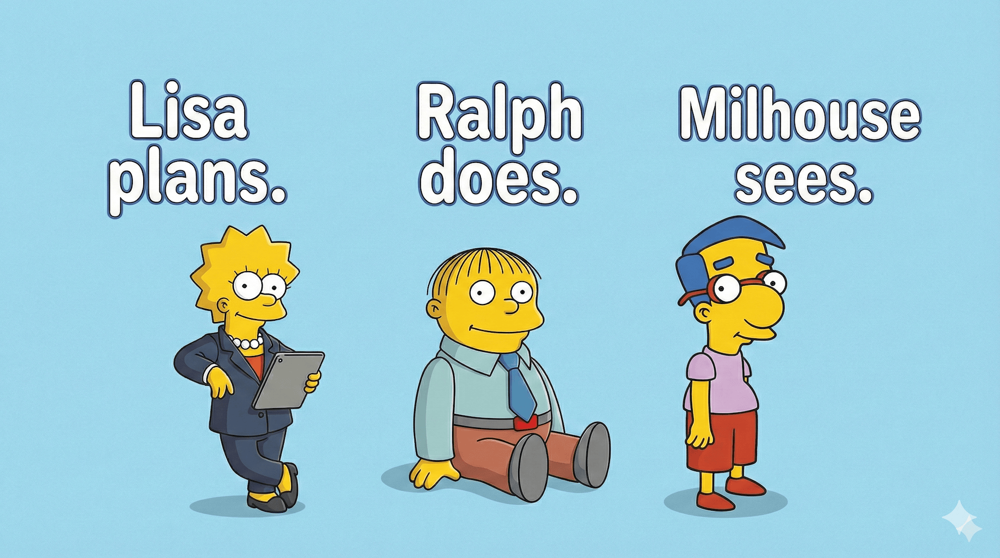

# Milhouse



**Visual QA plugin for Claude Code that validates implementations against design references using Claude Vision.**

> *"Milhouse validates. Ralph iterates."*

Milhouse is the visual validation component of the **Lisa-Ralph-Milhouse trilogy** for Claude Code development workflow.

## The Trilogy

```
┌─────────┐     ┌─────────┐     ┌──────────┐
│  LISA   │ ──► │  RALPH  │ ──► │ MILHOUSE │
│ (plan)  │     │ (build) │     │(validate)│
└─────────┘     └─────────┘     └──────────┘
                     ▲                │
                     │                │
                     └── feedback ────┘
```

- **[Lisa](https://github.com/blencorp/lisa)** - Generates detailed implementation specs from requirements
- **[Ralph Loop](https://github.com/anthropics/claude-plugins-official/tree/main/plugins/ralph-loop)** - Executes iterative implementation with promise-based validation
- **Milhouse** - Validates visual implementation against design references

## What is Milhouse?

Milhouse closes the visual feedback loop in your development workflow:

1. **Captures screenshots** of your implementation using Puppeteer
2. **Compares with references** (Figma exports, previous versions, or mockups)
3. **Analyzes differences** using Claude Vision API
4. **Generates actionable feedback** with specific CSS fixes
5. **Integrates with Ralph Loop** for automated corrections

### Key Features

- ✅ **Figma Integration** - Compare against Figma design exports
- ✅ **Screenshot Comparison** - Compare implementation versions (no Figma needed)
- ✅ **Regression Testing** - Detect unintended visual changes
- ✅ **Multi-Viewport Support** - Test desktop, tablet, and mobile
- ✅ **Detailed Feedback** - Specific CSS properties, values, and suggested fixes
- ✅ **Ralph Loop Integration** - Pass feedback directly to Ralph for corrections

## Installation

### Prerequisites

- Node.js >= 18.0.0
- Claude Code installed

### Setup (Commands in TERMINAL, outside Claude Code)

These commands install dependencies including Puppeteer (~300MB with Chromium):

```bash
# 1. Navigate to plugin directory
cd /path/to/milhouse

# 2. Install Node dependencies (Puppeteer + Sharp)
npm install
# This downloads ~300MB including Chromium browser

# Alternative: Use setup script (does the same)
# bash scripts/setup.sh

# 3. (Optional) For Figma API integration
export FIGMA_ACCESS_TOKEN=figd_your-token-here
# Add to ~/.zshrc or ~/.bashrc for persistence
```

### Verify Installation (In Claude Code)

```bash
# Inside Claude Code, run:
/milhouse:help
```

**Note:**
- The plugin runs Puppeteer locally from `node_modules/` in the plugin directory
- **No Anthropic API key needed** - Claude Code analyzes images directly using its built-in vision capabilities
- Each installation downloads Chromium (~300MB)

## Quick Start

### 5-Minute Workflow

**Step 1: Setup (in TERMINAL, once per machine)**
```bash
cd /path/to/milhouse
npm install
# That's it! No API keys needed.
```

**Step 2: Add reference image (manual)**
- Export design from Figma as PNG @2x
- Save to `.claude/figma-refs/design.png`

**Step 3: Use in Claude Code**
```bash
# Configure your project
/milhouse:configure --url http://localhost:8000

# Run visual validation (Claude Code analyzes the images)
/milhouse:check --reference .claude/figma-refs/design.png

# Claude will read both images and generate a detailed report
# Review the generated report
cat .claude/milhouse-feedback.md

# If there are differences, pass to Ralph
/ralph-loop "Read .claude/milhouse-feedback.md and fix all differences" --max-iterations 10
```

**How it works:** The command captures a screenshot with Puppeteer, then Claude Code reads both the screenshot and reference image directly, analyzes them using its vision capabilities, and generates the feedback report.

## Commands

### `/milhouse:check`

Compare your implementation against a Figma design.

```bash
# Basic usage
/milhouse:check --url http://localhost:8000 --reference .claude/figma-refs/home.png

# Mobile viewport
/milhouse:check --viewport 375x667

# Specific component
/milhouse:check --selector ".hero-section"

# Use defaults from config
/milhouse:check
```

**Arguments:**
- `--url` - URL to capture (default: from config)
- `--reference` - Path to reference image (default: from config)
- `--viewport` - Viewport size WxH (default: 1920x1080)
- `--selector` - CSS selector for specific element
- `--output` - Format: markdown, json, both (default: markdown)

### `/milhouse:compare`

Compare two screenshots directly (**no Figma required**).

```bash
# Regression testing
/milhouse:compare --current http://localhost:8000 --reference .claude/screenshots/v1.0.png

# Branch comparison
/milhouse:compare --current .claude/screenshots/feature.png --reference .claude/screenshots/main.png

# Environment comparison
/milhouse:compare --current https://staging.app.com --reference .claude/screenshots/prod.png
```

**Arguments:**
- `--current` - URL to capture or path to current screenshot
- `--reference` - Path to reference screenshot
- `--viewport` - Viewport size WxH (default: 1920x1080)
- `--selector` - CSS selector for specific element
- `--output` - Format: markdown, json, both (default: markdown)

**Use cases:**
- Regression testing (detect unintended changes)
- Branch comparison (visual diff before merge)
- Environment comparison (staging vs production)
- Mockup validation (validate against static designs)

### `/milhouse:configure`

Setup project configuration.

```bash
# Create default config
/milhouse:configure

# Set default URL
/milhouse:configure --url http://localhost:3000

# Set Figma file ID
/milhouse:configure --figma-file ABC123XYZ
```

### `/milhouse:export-figma`

Export frames from Figma as reference images.

```bash
# List available frames
/milhouse:export-figma --list

# Export specific frame
/milhouse:export-figma --frame "Home Desktop"
```

**Note:** Requires `FIGMA_ACCESS_TOKEN` environment variable and configured Figma file ID.

### `/milhouse:help`

Display plugin documentation.

## Usage Patterns

### Pattern 1: Lisa → Ralph → Milhouse (Full Trilogy)

The complete workflow using all three plugins:

```bash
# 1. LISA: Generate implementation spec
/lisa "Create a landing page with hero section, features grid, and footer"
# Output: detailed-spec.md

# 2. RALPH: Implement the spec
/ralph-loop "Implement the landing page according to detailed-spec.md" --max-iterations 20

# 3. MILHOUSE: Validate against design
/milhouse:check --reference .claude/figma-refs/landing-design.png

# 4. RALPH: Fix visual differences (if needed)
/ralph-loop "Read .claude/milhouse-feedback.md and fix all visual differences. Output <promise>VISUAL_FIXED</promise>" --max-iterations 10

# 5. MILHOUSE: Validate again
/milhouse:check --reference .claude/figma-refs/landing-design.png

# Repeat steps 4-5 until STATUS: APPROVED ✅
```

### Pattern 2: Regression Testing (No Figma)

Detect unintended visual changes without design files:

```bash
# Establish baseline (golden screenshot)
npm run dev
/milhouse:check --url http://localhost:8000
mkdir -p .claude/screenshots/golden
cp .claude/milhouse-screenshot.png .claude/screenshots/golden/v1.0-home.png

# After making changes, compare
/milhouse:compare \
  --current http://localhost:8000 \
  --reference .claude/screenshots/golden/v1.0-home.png

# If there are unintended changes, fix with Ralph
/ralph-loop "Visual regression detected. Read .claude/milhouse-feedback.md and revert unintended changes" --max-iterations 5

# Validate fix
/milhouse:compare \
  --current http://localhost:8000 \
  --reference .claude/screenshots/golden/v1.0-home.png
```

### Pattern 3: Branch Comparison

Compare visual changes before merging:

```bash
# Capture main branch
git checkout main && npm run dev
/milhouse:check --url http://localhost:3000
cp .claude/milhouse-screenshot.png .claude/screenshots/main.png

# Compare feature branch
git checkout feature/redesign && npm run dev
/milhouse:compare \
  --current http://localhost:3000 \
  --reference .claude/screenshots/main.png

# Review changes
cat .claude/milhouse-feedback.md
```

## Output Structure

Milhouse generates structured reports with actionable feedback:

### Markdown Report (`.claude/milhouse-feedback.md`)

```markdown
# Milhouse Visual QA Report

**Status:** DIFFERENCES_FOUND
**Summary:** Found 3 differences requiring correction

## ❌ DIFFERENCES FOUND

### 🔴 Critical (1)
**1. Hero Button** (color)
- **Issue:** Button color doesn't match design
- **Current:** `#3B82F6`
- **Expected:** `#2563EB`
- **CSS Property:** `background-color`
- **Suggested Fix:**
  ```css
  .hero-button {
    background-color: #2563EB;
  }
  ```

### 🟠 Major (1)
**2. Header Spacing** (spacing)
- **Issue:** Top padding is smaller than design
- **Current:** `16px`
- **Expected:** `24px`
- **CSS Property:** `padding-top`
- **Suggested Fix:**
  ```css
  .header {
    padding-top: 24px;
  }
  ```

## 📋 Summary for Ralph

```
Fix the following visual differences:
- Hero Button: Change background-color from "#3B82F6" to "#2563EB"
- Header Spacing: Change padding-top from "16px" to "24px"

After corrections, output <promise>VISUAL_FIXED</promise>
```
```

### JSON Report (`.claude/milhouse-feedback.json`)

```json
{
  "status": "DIFFERENCES_FOUND",
  "summary": "Found 3 differences requiring correction",
  "differences": [
    {
      "element": "Hero Button",
      "category": "color",
      "description": "Button color doesn't match design",
      "current": "#3B82F6",
      "expected": "#2563EB",
      "severity": "critical",
      "cssProperty": "background-color",
      "suggestedFix": ".hero-button {\n  background-color: #2563EB;\n}"
    }
  ],
  "approvedElements": ["Logo", "Navigation", "Footer"]
}
```

## Configuration

### Project Configuration (`.claude/milhouse.config.json`)

```json
{
  "url": "http://localhost:8000",
  "reference": ".claude/figma-refs/design.png",
  "referenceDir": ".claude/figma-refs",
  "viewports": {
    "desktop": "1920x1080",
    "tablet": "768x1024",
    "mobile": "375x667"
  },
  "tolerance": "normal",
  "waitTime": 2000,
  "waitForSelector": null,
  "figma": {
    "fileId": null,
    "token": null
  }
}
```

### Environment Variables

**Optional (for Figma API integration only):**
```bash
export FIGMA_ACCESS_TOKEN=figd_your-token
```

**Note:** No Anthropic API key needed! Claude Code analyzes images using its built-in vision capabilities.

## Integration with Ralph Loop

Milhouse is designed to work seamlessly with Ralph Loop:

```bash
# Ralph implements
/ralph-loop "Build landing page" --max-iterations 20

# Milhouse validates
/milhouse:check

# Ralph fixes (if needed)
/ralph-loop "Fix visual issues per milhouse-feedback.md" --max-iterations 10

# Iterate until approved
```

### Ralph Promise Pattern

Use promises to track visual completion:

```bash
/ralph-loop "Implement hero section. After implementation, run Milhouse validation and fix all issues until STATUS: APPROVED. Output <promise>HERO_VISUAL_APPROVED</promise>" --max-iterations 30
```

## File Organization

### Generated Files

```
project-root/
├── .claude/
│   ├── milhouse.config.json         # Project configuration
│   ├── milhouse-feedback.md         # Latest validation report
│   ├── milhouse-feedback.json       # Report data (structured)
│   ├── milhouse-screenshot.png      # Latest screenshot
│   ├── figma-refs/                  # Figma design references
│   │   ├── home-desktop.png
│   │   ├── home-mobile.png
│   │   └── dashboard.png
│   └── screenshots/                 # Screenshot library
│       ├── golden/                  # Approved versions
│       │   ├── v1.0-home.png
│       │   └── v1.1-dashboard.png
│       ├── branches/                # Branch comparisons
│       │   ├── main-home.png
│       │   └── feature-home.png
│       └── environments/            # Environment captures
│           ├── production.png
│           └── staging.png
```

## Advanced Features

### Multi-Viewport Validation

Validate across different screen sizes:

```bash
# Desktop
/milhouse:check --viewport 1920x1080 --reference .claude/figma-refs/home-desktop.png

# Tablet
/milhouse:check --viewport 768x1024 --reference .claude/figma-refs/home-tablet.png

# Mobile
/milhouse:check --viewport 375x667 --reference .claude/figma-refs/home-mobile.png
```

### Component-Level Validation

Validate specific components:

```bash
# Validate only the hero section
/milhouse:check --selector ".hero-section" --reference .claude/figma-refs/hero.png

# Validate navigation
/milhouse:check --selector "nav" --reference .claude/figma-refs/nav.png
```

### Batch Validation Script

Create a validation script for multiple pages:

```bash
#!/bin/bash
# validate-all.sh

pages=("home" "about" "contact")
viewports=("1920x1080" "375x667")

for page in "${pages[@]}"; do
  for viewport in "${viewports[@]}"; do
    echo "Validating $page at $viewport..."
    /milhouse:check \
      --url "http://localhost:8000/$page" \
      --viewport "$viewport" \
      --reference ".claude/figma-refs/$page-$viewport.png"
  done
done
```

## Comparison: /milhouse:check vs /milhouse:compare

| Feature | `/milhouse:check` | `/milhouse:compare` |
|---------|-------------------|---------------------|
| **Purpose** | Validate against Figma design | Compare implementation versions |
| **Reference** | Figma export (original design) | Screenshot (previous implementation) |
| **Prompt** | Design vs implementation | Current vs reference |
| **Primary Use** | Design fidelity validation | Regression testing, branch comparison |
| **Figma Required** | No (any image works) | No |

## Troubleshooting

### Error: "Screenshot failed"

**Causes:**
- Server not running
- Invalid URL
- Puppeteer timeout

**Solutions:**
```bash
# Verify server is running
curl http://localhost:8000

# Increase wait time in config
# Edit .claude/milhouse.config.json:
{
  "waitTime": 5000  // increased from 2000
}
```

### Error: "Reference image not found"

```bash
# Verify reference exists
ls -la .claude/figma-refs/

# Create directory if needed
mkdir -p .claude/figma-refs

# Add reference image
```

### Puppeteer Issues on Linux

```bash
# Install system dependencies
sudo apt-get install -y \
  libnss3 \
  libatk-bridge2.0-0 \
  libdrm2 \
  libxkbcommon0 \
  libgbm1 \
  libasound2
```

## Best Practices

### 1. Maintain Golden Screenshots

Keep approved versions for regression testing:

```bash
# Structure
.claude/screenshots/golden/
├── v1.0-home-desktop.png
├── v1.0-home-mobile.png
├── v1.0-dashboard-desktop.png
└── v1.1-home-desktop.png  # Updated version
```

### 2. Consistent Naming

Use descriptive, consistent names:

```
{version}-{page}-{viewport}.png

Examples:
- v1.0-home-desktop.png
- v1.0-home-mobile.png
- v1.1-dashboard-tablet.png
```

### 3. Version Control

Commit golden screenshots to git:

```bash
git add .claude/screenshots/golden/
git commit -m "Add v1.0 golden screenshots"
```

### 4. Component-Based Validation

Validate components individually for faster feedback:

```bash
# Instead of validating entire page
/milhouse:check --selector ".hero"
/milhouse:check --selector ".features"
/milhouse:check --selector ".footer"
```

### 5. Iterative Validation

Validate early and often:

```bash
# After implementing hero
/milhouse:check --selector ".hero"

# After implementing features
/milhouse:check --selector ".features"

# Full page validation
/milhouse:check
```

## CI/CD Integration

**Note:** CI/CD integration requires Claude Code to be available in your pipeline environment. For traditional CI/CD without Claude Code, consider using pixel-diff tools (pixelmatch, BackstopJS, etc.) instead.

If you have Claude Code in your CI environment:

```yaml
name: Visual Regression
on: [pull_request]

jobs:
  visual-test:
    runs-on: ubuntu-latest
    steps:
      - uses: actions/checkout@v3

      - name: Setup Node
        uses: actions/setup-node@v3
        with:
          node-version: 18

      - name: Install dependencies
        run: |
          npm install
          cd milhouse && npm install

      - name: Start dev server
        run: npm run dev &

      - name: Wait for server
        run: sleep 5

      - name: Run Milhouse validation
        # This requires Claude Code CLI in CI environment
        run: |
          claude-code /milhouse:compare \
            --current http://localhost:3000 \
            --reference .claude/screenshots/golden/main.png

      - name: Upload report
        uses: actions/upload-artifact@v3
        with:
          name: visual-diff-report
          path: .claude/milhouse-feedback.md

      - name: Comment PR
        if: failure()
        uses: actions/github-script@v6
        with:
          script: |
            const fs = require('fs');
            const report = fs.readFileSync('.claude/milhouse-feedback.md', 'utf8');
            github.rest.issues.createComment({
              issue_number: context.issue.number,
              owner: context.repo.owner,
              repo: context.repo.repo,
              body: `## Visual Regression Detected\n\n${report}`
            });
```

## Dependencies

- **Node.js** >= 18.0.0
- **Puppeteer** ^22.0.0 - Headless browser for screenshots
- **Sharp** ^0.33.0 - Image processing (optional)
- **jq** - JSON manipulation in bash scripts

## Plugin Architecture

```
milhouse/
├── .claude-plugin/
│   └── plugin.json              # Plugin metadata
├── commands/                    # Slash command definitions
│   ├── check.md                 # /milhouse:check
│   ├── compare.md               # /milhouse:compare
│   ├── configure.md             # /milhouse:configure
│   ├── export-figma.md          # /milhouse:export-figma
│   └── help.md                  # /milhouse:help
├── scripts/                     # Core functionality
│   ├── screenshot.js            # Puppeteer screenshot capture
│   ├── compare-vision.js        # Claude Vision API integration
│   ├── figma-export.js          # Figma API integration
│   ├── setup.sh                 # Dependency installer
│   └── verify.sh                # Installation verification
├── templates/
│   ├── config-template.json     # Configuration schema
│   └── feedback-template.md     # Report template
└── hooks/
    └── hooks.json               # No hooks (passive plugin)
```

## Roadmap

- [ ] Multi-viewport batch validation
- [ ] Multiple page comparison in single command
- [ ] Visual diff image generation (highlighted differences)
- [ ] Video/animation support
- [ ] Quantitative similarity metrics
- [ ] Percy.io integration
- [ ] Chromatic integration
- [ ] WebdriverIO support

## Contributing

Contributions are welcome! Please:

1. Fork the repository
2. Create a feature branch
3. Make your changes
4. Test thoroughly
5. Submit a pull request

## Support

- **Documentation:** See [QUICKSTART.md](./QUICKSTART.md) for quick setup
- **Issues:** [GitHub Issues](https://github.com/anthropics/claude-code/issues)
- **Discussions:** [GitHub Discussions](https://github.com/anthropics/claude-code/discussions)

## License

MIT License - See [LICENSE](./LICENSE)

## Acknowledgments

- Part of the **Lisa-Ralph-Milhouse trilogy** for Claude Code
- Built with [Claude Vision API](https://www.anthropic.com/claude)
- Inspired by visual regression tools like Percy, Chromatic, and BackstopJS
- Named after Milhouse Van Houten from The Simpsons (the validator of the group)

---

**Made with ❤️ by the Claude Plugins Team**

[Lisa](https://github.com/blencorp/lisa) · [Ralph Loop](https://github.com/anthropics/claude-plugins-official/tree/main/plugins/ralph-loop) · **Milhouse**
